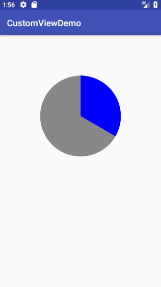
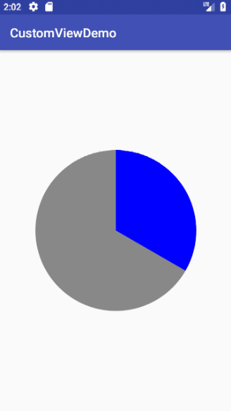
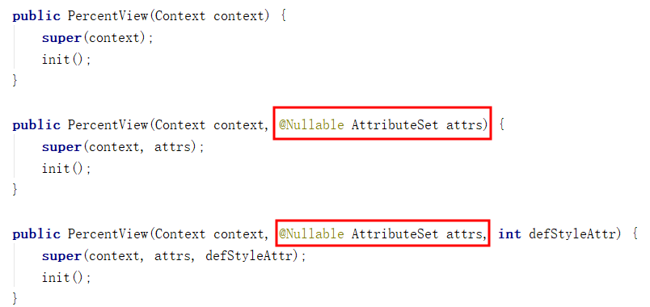

# 自定义控件
## 1.前言
在日常的Android开发中会经常和控件打交道，有时Android提供的控件未必能满足
业务的需求，这个时候就需要我们实现自定义一些控件，今天先大致了解一下自定
义控件的要求和实现的基本原理。

自定义控件要求：
- 1.应当遵守Android标准的规范(命名，可配置，事件处理等)。
- 2.在XML布局中可配置控件的属性。
- 3.对交互应当有合适的反馈，比如按下，点击等。
- 4.具有兼容性， Android版本很多，应该具有广泛的适用性。

自定义控件学习步骤：
- 1 .View的工作原理
- 2 .编写View类
- 3.为View类增加属性
- 4 .绘制屏幕
- 5.响应用户消息
- 6 .自定义回调函数

自定义控件两种方式：
- 1.继承ViewGroup

  例如：ViewGroup、LinearLayout、FrameLayout、RelativeLayout等。

- 2.继承View

  例如：View、TextView、ImageView、Button等。

## 2.自定义控件基本绘制原理：
View的绘制基本上由measure()、layout()、draw()这个三个函数完成

### 2.1测量-Measure过程是计算视图大小，View measure过程相关方法主要有三个：
     public final void measure(int widthMeasureSpec, int heightMeasureSpec)
     protected final void setMeasuredDimension(int measuredWidth, int measuredHeight)
     protected void onMeasure(int widthMeasureSpec, int heightMeasureSpec)
 measure调用onMeasure，onMeasure测量宽度、高度，然后调用setMeasureDimension保存测量结果，
 measure，setMeasureDimension是final类型，view的子类不需要重写，onMeasure在view的子类中重写。

 关于MeasureSpec：

MeasureSpec通过将SpecMode和SpecSize打包成一个int值来避免过多的对象内存分配，为了方便操作，
其提供了打包和解包的方法。SpecMode和SpecSize也是一个int值，一组SpecMode和SpecSize可以打包
为一个MeasureSpec，而一个MeasureSpec可以通过解包的形式来得出其原始的SpecMode和SpecSize。

只要记住以下一句话即可：

MeasureSpec的值由specSize和specMode共同组成的，其中specSize记录的是大小，specMode记录的是规格。

SpecMode的三种模式：

     1. EXACTLY
     当我们将控件的“layout_width”属性或者“layout_height”属性指定为具体数值时，比如
     “android:layout_width="200dp"”，或者指定为“match_parent”时，系统会使用这个模式。

     2. AT_MOST
     当控件的“layout_width”属性或者“layout_height”属性设置为“wrap_content”时，控件
     大小一般会随着内容的大小而变化，但是无论多大，也不能超过父控件的尺寸。

     3. UNSPECIFIED
     表示开发人员可以将视图按照自己的意愿设置成任意的大小，没有任何限制。这种情况比较少见，
     一般在绘制自定义View的时候才会用到。

### 2.2布局-Layout过程用于设置视图在屏幕中显示的位置，View layout过程相关方法主要要三个：
     public void layout(int l, int t, int r, int b)
     protected boolean setFrame(int left, int top, int right, int bottom)
     protected void onLayout(boolean changed, int left, int top, int right, int bottom)
  layout通过调用setFrame（l,t,r,b），l,t,r,b即子视图在父视图中的具体位置，onLayout一般只会在自定义ViewGroup中才会使用

### 2.3绘制-draw过程主要用于利用前两步得到的参数，将视图显示在屏幕上，到这里也就完成了整个的视图绘制工作。
     public void draw(Canvas canvas)
     protected void onDraw(Canvas canvas)
 通过调用draw函数进行视图绘制，在View类中onDraw函数是个空函数，最终的
 绘制需求需要在自定义的onDraw函数中进行实现，比如ImageView完成图片的
 绘制，如果自定义ViewGroup这个函数则不需要重载。

## 3.自定义控件示例：
这里先介绍继承View的方式为例，其实ViewGroup最终的继承的也是View。这里模拟
一个需求场景，需要一个圆形显示百分比。
### 3.1 继承View类，创建PercentView类
    public class PercentView extends View {
        private static final String TAG = "PercentView";
        private Paint mPaint;
        private RectF oval;

        public PercentView(Context context) {
            super(context);
            init();
        }

        public PercentView(Context context, @Nullable AttributeSet attrs) {
            super(context, attrs);
            init();
        }

        public PercentView(Context context, @Nullable AttributeSet attrs, int defStyleAttr) {
            super(context, attrs, defStyleAttr);
            init();
        }

        private void init(){
            mPaint = new Paint();
            mPaint.setAntiAlias(true);
            oval=new RectF();
        }
        @Override
        protected void onMeasure(int widthMeasureSpec, int heightMeasureSpec) {
            super.onMeasure(widthMeasureSpec, heightMeasureSpec);
            int widthMode = MeasureSpec.getMode(widthMeasureSpec);
            int widthSize = MeasureSpec.getSize(widthMeasureSpec);
            int heightMode = MeasureSpec.getMode(heightMeasureSpec);
            int heightSize = MeasureSpec.getSize(heightMeasureSpec);
            Log.e(TAG, "onMeasure--widthMode-->" + widthMode);
            switch (widthMode) {
                case MeasureSpec.EXACTLY:

                    break;
                case MeasureSpec.AT_MOST:

                    break;
                case MeasureSpec.UNSPECIFIED:

                    break;
            }
            Log.e(TAG, "onMeasure--widthSize-->" + widthSize);
            Log.e(TAG, "onMeasure--heightMode-->" + heightMode);
            Log.e(TAG, "onMeasure--heightSize-->" + heightSize);
        }

        @Override
        protected void onLayout(boolean changed, int left, int top, int right, int bottom) {
            super.onLayout(changed, left, top, right, bottom);
            Log.e(TAG, "onLayout");
        }

        @Override
        protected void onDraw(Canvas canvas) {
            super.onDraw(canvas);
            mPaint.setColor(Color.GRAY);
            // FILL填充, STROKE描边,FILL_AND_STROKE填充和描边
            mPaint.setStyle(Paint.Style.FILL_AND_STROKE);
            int with = getWidth();
            int height = getHeight();
            Log.e(TAG, "onDraw---->" + with + "*" + height);
            float radius = with / 4;
            canvas.drawCircle(with / 2, with / 2, radius, mPaint);
            mPaint.setColor(Color.BLUE);
            oval.set(with / 2 - radius, with / 2 - radius, with / 2
                    + radius, with / 2 + radius);//用于定义的圆弧的形状和大小的界限
            canvas.drawArc(oval, 270, 120, true, mPaint);  //根据进度画圆弧
        }
    }
### 3.2 使用PercentView
    <?xml version="1.0" encoding="utf-8"?>
    <android.support.constraint.ConstraintLayout xmlns:android="http://schemas.android.com/apk/res/android"
        xmlns:app="http://schemas.android.com/apk/res-auto"
        xmlns:tools="http://schemas.android.com/tools"
        android:layout_width="match_parent"
        android:layout_height="match_parent"
        tools:context="cn.wang.customviewdemo.MainActivity">

        <cn.wang.customviewdemo.PercentView
            android:layout_width="wrap_content"
            android:layout_height="wrap_content"
            app:layout_constraintBottom_toBottomOf="parent"
            app:layout_constraintLeft_toLeftOf="parent"
            app:layout_constraintRight_toRightOf="parent"
            app:layout_constraintTop_toTopOf="parent" />

    </android.support.constraint.ConstraintLayout>
运行后的效果如下图：

若将PercentView的布局改为：

    <cn.wang.customviewdemo.PercentView
            android:layout_width="500dp"
            android:layout_height="500dp"
            app:layout_constraintBottom_toBottomOf="parent"
            app:layout_constraintLeft_toLeftOf="parent"
            app:layout_constraintRight_toRightOf="parent"
            app:layout_constraintTop_toTopOf="parent" />
则，运行效果如下：

## 4.自定义属性
### 4.1 需求
为何要引入自定义属性？当Android提供的原生属性不能满足实际的需求的时候，
比如我们需要自定义圆形百分比半径大小、圆形背景、圆形显示的位置、圆形进
度的背景等等。这个时候就需要我们自定义属性了。
### 4.2 如何自定义属性
#### 4.2.1 在res/values文件下添加一个attrs.xml文件
如果项目比较大的话，会导致attrs.xml代码相当庞大，这时可以根据相应的功能
模块起名字，方便查找，例如：登录模块相关attrs_login.xml

    <?xml version="1.0" encoding="utf-8"?>
    <resources>
        <declare-styleable name="PercentView">
            <!--添加属性-->
        </declare-styleable>
    </resources>
#### 4.2.2 如何声明一组属性
然后就是定义属性值了，通过<attr name="textColor" format="color" /> 方式
定义属性值，属性名字同样也要起的见名知意，format表示这个属性的值的类型,
类型有以下几种:
- reference:引用资源
- string:字符串
- Color：颜色
- boolean：布尔值
- dimension：尺寸值
- float：浮点型
- integer：整型
- fraction：百分数
- enum：枚举类型
- flag：位或运算

基于上面的要求，我们可以定义一下百分比控件属性

    <?xml version="1.0" encoding="utf-8"?>
    <resources>
        <declare-styleable name="PercentView">
            <!--添加属性-->
            <attr name="percent_circle_gravity"><!--圆形绘制的位置-->
                <flag name="left" value="0" />
                <flag name="top" value="1" />
                <flag name="center" value="2" />
                <flag name="right" value="3" />
                <flag name="bottom" value="4" />
            </attr>
            <attr name="percent_circle_radius" format="dimension" /><!--圆形半径-->
            <attr name="percent_circle_progress" format="integer" /><!--当前进度值-->
            <attr name="percent_progress_color" format="color" /><!--进度显示颜色-->
            <attr name="percent_background_color" format="color" /><!--圆形背景色-->
        </declare-styleable>
    </resources>
#### 4.2.3 布局中如何使用
    <?xml version="1.0" encoding="utf-8"?>
    <android.support.constraint.ConstraintLayout xmlns:android="http://schemas.android.com/apk/res/android"
        xmlns:app="http://schemas.android.com/apk/res-auto"
        xmlns:tools="http://schemas.android.com/tools"
        android:layout_width="match_parent"
        android:layout_height="match_parent"
        tools:context="cn.wang.customviewdemo.MainActivity">

        <cn.wang.customviewdemo.PercentView
            android:layout_width="500dp"
            android:layout_height="500dp"
            app:percent_circle_gravity="left"
            app:percent_background_color="#ffff0000"
            app:percent_circle_radius="400dp"
            app:percent_circle_progress="50"
            app:percent_progress_color="@color/colorPrimary"
            app:layout_constraintBottom_toBottomOf="parent"
            app:layout_constraintLeft_toLeftOf="parent"
            app:layout_constraintRight_toRightOf="parent"
            app:layout_constraintTop_toTopOf="parent" />

    </android.support.constraint.ConstraintLayout>

自定义的属性，需要在布局中添加

xmlns:app="http://schemas.android.com/apk/res-auto"

注意：可以将app修改为其他名字。
#### 4.2.4 自定义控件中如何获取自定义属性
每一个属性集合编译之后都会对应一个styleable对象，通过styleable对象获取
TypedArray typedArray，然后通过键值对获取属性值，这点有点类似
SharedPreference的取法。

    TypedArray typedArray = context.obtainStyledAttributes(attrs, R.styleable.PercentView);
        if (typedArray != null) {
            backgroundColor = typedArray.getColor(R.styleable.PercentView_percent_background_color, Color.GRAY);
            progressColor = typedArray.getColor(R.styleable.PercentView_percent_progress_color, Color.BLUE);
            radius = typedArray.getDimension(R.styleable.PercentView_percent_circle_radius, 0);
            progress = typedArray.getInt(R.styleable.PercentView_percent_circle_progress, 0);
            gravity = typedArray.getInt(R.styleable.PercentView_percent_circle_gravity, CENTER);
            typedArray.recycle();
         }

> PercentView_percent_background_color为：styleable对象名+"_"+属性名，一定要注意。

仔细观察PercentView的构造函数，发现第二个和第三个都需要书写以上代码，故可以
将此段代码写为一个方法。

在PercentView.java中，增加如下方法：

    private void initParams(Context context, AttributeSet attrs) {
            mPaint = new Paint();
            mPaint.setAntiAlias(true);
            oval = new RectF();
            TypedArray typedArray = context.obtainStyledAttributes(attrs, R.styleable.PercentView);
            if (typedArray != null) {
                backgroundColor = typedArray.getColor(R.styleable.PercentView_percent_background_color, Color.GRAY);
                progressColor = typedArray.getColor(R.styleable.PercentView_percent_progress_color, Color.BLUE);
                radius = typedArray.getDimension(R.styleable.PercentView_percent_circle_radius, 0);
                progress = typedArray.getInt(R.styleable.PercentView_percent_circle_progress, 0);
                gravity = typedArray.getInt(R.styleable.PercentView_percent_circle_gravity, CENTER);
                typedArray.recycle();
            }
        }

并将上述两个构造函数修改为：

    public PercentView(Context context, @Nullable AttributeSet attrs) {
            super(context, attrs);
            initParams(context,attrs);
        }

        public PercentView(Context context, @Nullable AttributeSet attrs, int defStyleAttr) {
            super(context, attrs, defStyleAttr);
            initParams(context,attrs);
        }

然后，就是在测量时，根据gravity的值调整圆心的位置；在绘制时，使用用户指定的
参数进行图形的绘制。具体代码请直接看源码，在此不再给出。

